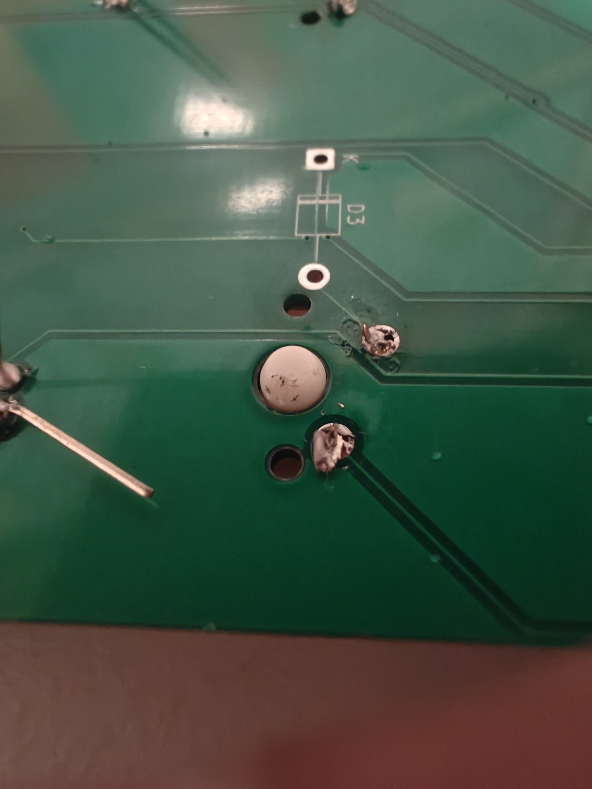
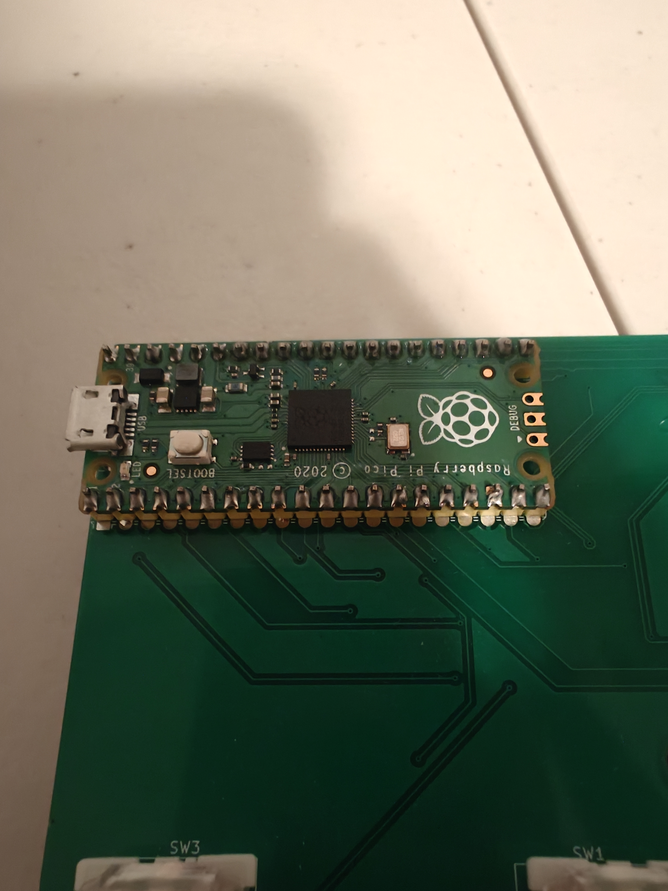

# September 2: Sodered some of the basic components.

This devlog I worked on trying to soder all the components onto the pcb. This is my first time sodering so it did not go the best. I partially burnt one of the key switches, oops. . The resistors were very messy as well with the the footprint being too small to actually fit the resistor properly. The other than this I feel like my sodering on the raspberry pi pico was good enough that . Overall, this is not too bad. I really need to be more efficient in my time though.

-Recording links
https://lapse.hackclub.com/timelapse/0V47lkOwijM5
https://lapse.hackclub.com/timelapse/Xaw-gElLUrd_
https://lapse.hackclub.com/timelapse/J6UoXvX0RNCo
https://lapse.hackclub.com/timelapse/zv9pdq6mI1ch
https://lapse.hackclub.com/timelapse/Xwd5ic2uPJUL

**Total time spent: 1.56 hours**
