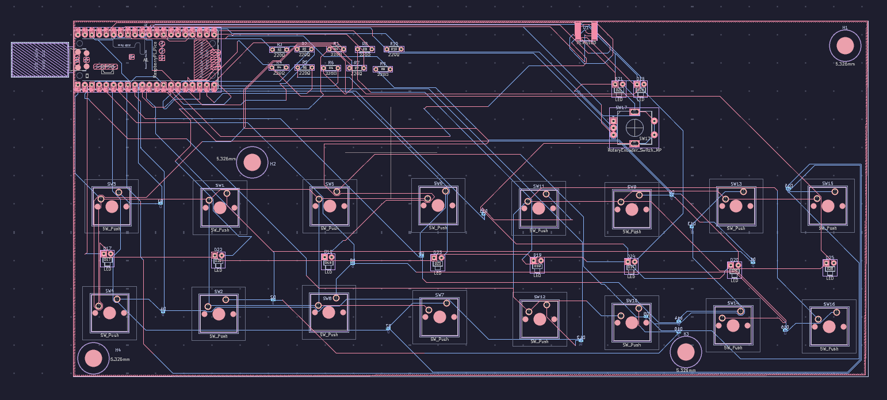
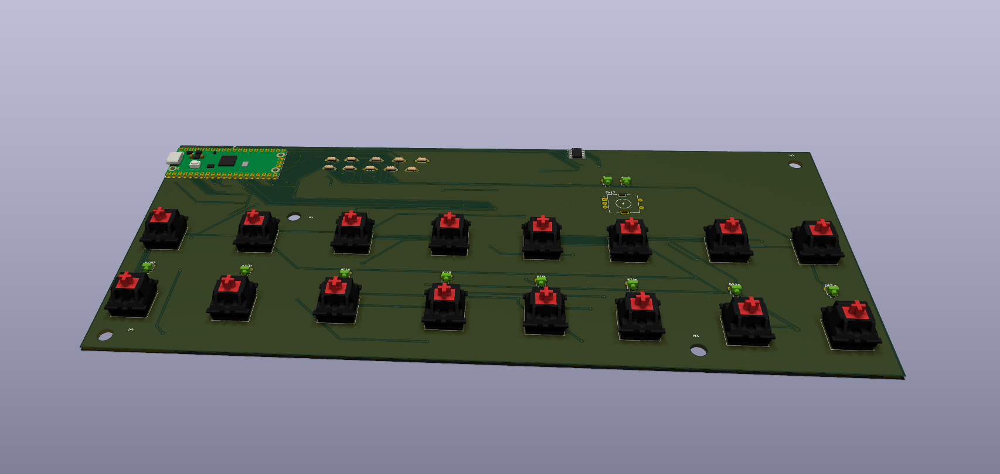
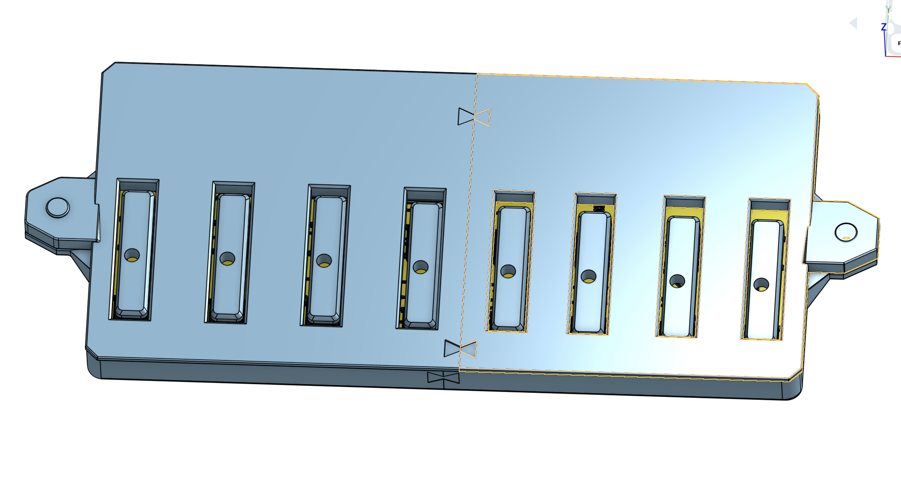

# Learnboard
Learnboard is a midi keyboard that I designed to "get my foot through the door" of creating hardware projects. This keyboard has 8 keys(16 physical switches). This keyboard has the feature to load "songs" into it. This keyboard also has LEDs that are under each of the 8 keys. These will light up whenyou hit the key or if the song that is loaded requires it.

## Features
* Freeplay mode
* Song loading mode
* Key Acceleration detection

## PCB
The learnboard's PCB has 2 layers.

## Usage
To use the learnboard in the most basic context you simply hit the keys and the corresponding LED on that key will light up. To use the non freeplay mode you must use the webui that is inside the respective folder(This is a html document). From there you can adjust many things with the learnboard(Such as volume). The song loading works by loading .json files through the webui. To connect the midi keyboard to the webui you have to connect the midi keyboard to your computer.

## Case

The case can be printed in several pieces. To hold the case pieces that are printed seperately there are "bowtie" connectors to connect these. The connector for the case top and the case bottom can be printed however a machine screw can also be used for that purpose. The .step files will be in the CAD folder. When printing I split the case into four parts. Two of the parts are in the Case.step file and the other two are in the caseTop.step file

## BOM
Here is the BOM. I put n/a in place of anything that I already had.
| Id | Designator                                                             | Footprint                                          | Quantity | Designation             | Supplier and ref                                                                                                                                                                                                                                                                                                                                                                                                                                                                                                                                                                                                                                                                                 | Unit price | Total price |   | Component         | Price  |
|----|------------------------------------------------------------------------|----------------------------------------------------|----------|-------------------------|--------------------------------------------------------------------------------------------------------------------------------------------------------------------------------------------------------------------------------------------------------------------------------------------------------------------------------------------------------------------------------------------------------------------------------------------------------------------------------------------------------------------------------------------------------------------------------------------------------------------------------------------------------------------------------------------------|------------|-------------|---|-------------------|--------|
| 1  | D19,D18,D22,D25,D21,D23,D24,D26,D17,D20                                | LED_D1.8mm_W1.8mm_H2.4mm_Horizontal_O1.27mm_Z1.6mm | 10       | LED                     | n/a                                                                                                                                                                                                                                                                                                                                                                                                                                                                                                                                                                                                                                                                                      | n/a        | n/a         |   | LED               | n/a    |
| 2  | SW9,SW15,SW14,SW4,SW8,SW2,SW16,SW5,SW13,SW10,SW1,SW6,SW3,SW11,SW7,SW12 | SW_Cherry_MX_1.00u_PCB                             | 16       | SW_Push                 | https://www.adafruit.com/product/4955                                                                                                                                                                                                                                                                                                                                                                                                                                                                                                                                                                                                                                                            | $0.70      | $12.65      |   | Key Switches      | $12.65 |
| 3  | R10,R7,R2,R6,R5,R9,R8,R3,R1,R4                                         | R_Axial_DIN0204_L3.6mm_D1.6mm_P5.08mm_Horizontal   | 10       | 220Ω                    | n/a                                                                                                                                                                                                                                                                                                                                                                                                                                                                                                                                                                                                                                                                                      | n/a        | n/a         |   | Resistor          | n/a    |
| 4  | A1                                                                     | RaspberryPi_Pico_Common_Unspecified                | 1        | RaspberryPi_Pico        | https://www.sparkfun.com/raspberry-pi-pico.html?src=raspberrypii                                                                                                                                                                                                                                                                                                                                                                                                                                                                                                                                                                                                                                 | $4.60      | $4.60       |   | Raspberry pi_pico | $4.60  |
| 5  | U1                                                                     | TSSOP-20_4.4x6.5mm_P0.65mm                         | 1        | PCM5100                 | https://www.adafruit.com/product/6251                                                                                                                                                                                                                                                                                                                                                                                                                                                                                                                                                                                                                                                            | $3.95      | $3.95       |   | PCM5100           | $3.95  |
| 6  | SW17                                                                   | RotaryEncoder_Alps_EC11E-Switch_Vertical_H20mm     | 1        | RotaryEncoder_Switch_MP | https://www.aliexpress.us/item/3256805796844720.html?spm=a2g0o.productlist.main.9.4d112f4fSXZeMN&algo_pvid=eb9d02a3-f920-4262-a022-a9b573057c96&algo_exp_id=eb9d02a3-f920-4262-a022-a9b573057c96-8&pdp_ext_f=%7B%22order%22%3A%22532%22%2C%22spu_best_type%22%3A%22price%22%2C%22eval%22%3A%221%22%2C%22fromPage%22%3A%22search%22%7D&pdp_npi=6%40dis%21USD%212.61%210.99%21%21%212.61%210.99%21%402101e07217747380086304188e2dac%2112000035172878115%21sea%21US%210%21ABX%211%210%21n_tag%3A-29910%3Bd%3Ae5ad1807%3Bm03_new_user%3A-29895%3BpisId%3A5000000197847458&curPageLogUid=BsEmvmq8uiF0&utparam-url=scene%3Asearch%7Cquery_from%3A%7Cx_object_id%3A1005005983159472%7C_p_origin_prod%3A | $0.99      | $0.99       |   | Rotary Encoder    | $0.99  |
| 7  | D12,D11,D8,D7,D13,D3,D6,D16,D10,D15,D14,D4,D1,D9,D2,D5                 | D_0201_0603Metric_Pad0.64x0.40mm_HandSolder        | 16       | D                       | https://www.aliexpress.us/item/3256807405706559.html?spm=a2g0o.productlist.main.27.1b48129cFrGIk1&algo_pvid=87449cb5-14c6-4152-86df-b397606df8f7&algo_exp_id=87449cb5-14c6-4152-86df-b397606df8f7-26&pdp_ext_f=%7B%22order%22%3A%224%22%2C%22eval%22%3A%221%22%2C%22fromPage%22%3A%22search%22%7D&pdp_npi=6%40dis%21USD%211.05%211.05%21%21%211.05%211.05%21%402101df0e17747381828495492e3639%2112000041420706589%21sea%21US%210%21ABX%211%210%21n_tag%3A-29910%3Bd%3Ae5ad1807%3Bm03_new_user%3A-29895&curPageLogUid=XZfqPJw1CEqM&utparam-url=scene%3Asearch%7Cquery_from%3A%7Cx_object_id%3A1005007592021311%7C_p_origin_prod%3A                                                                | $0.11      | $2.10       |   | Diodes            | $2.10  |
|    |                                                                        |                                                    |          |                         |                                                                                                                                                                                                                                                                                                                                                                                                                                                                                                                                                                                                                                                                                                  |            |             |   | PCB               | $18.20 |
|    |                                                                        |                                                    |          |                         |                                                                                                                                                                                                                                                                                                                                                                                                                                                                                                                                                                                                                                                                                                  |            |             |   | Shipping          | $22.19 |
|    |                                                                        |                                                    |          |                         |                                                                                                                                                                                                                                                                                                                                                                                                                                                                                                                                                                                                                                                                                                  |            |             |   | Total             | $64.68 |

### poster

